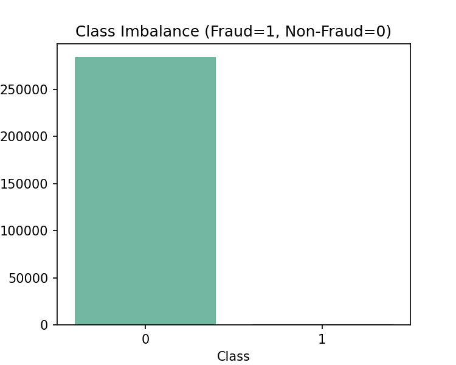
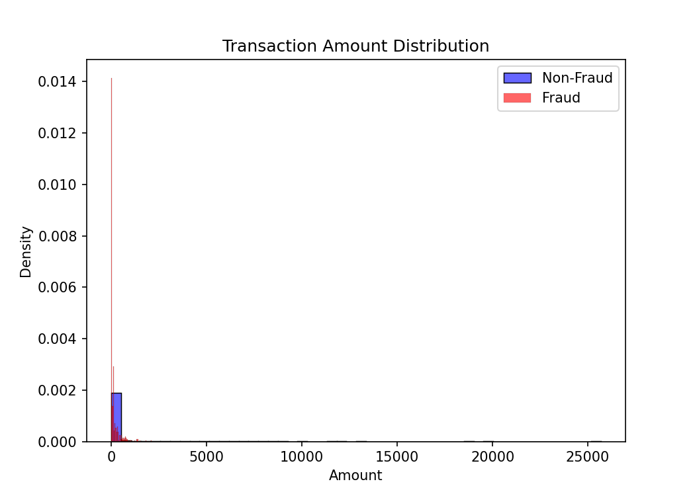
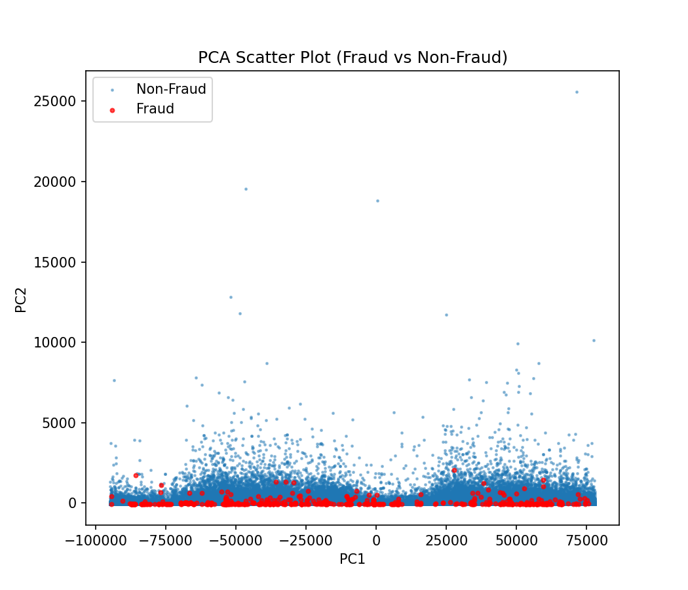

# Credit Card Fraud Detection Trends

##  Introduction
This project analyzes the **Kaggle Credit Card Fraud dataset** to identify fraud detection trends.  
The focus is on **visualizing class imbalance, transaction amount patterns, and PCA plots** to study the separation between fraud and non-fraud transactions.  

 Total Transactions: **284,807**
 Fraud Cases: **492 (0.17%)**
Non-Fraud Cases: **284,315**

##  Project Goal
**Visualize class imbalance and fraud transaction amount patterns in fraud vs non-fraud, using PCA for visualization.**

##  Visualizations

### 1. Class Imbalance
Fraud cases are extremely rare compared to non-fraud.  

### 2. Amount Distribution
Fraud transactions generally involve smaller amounts compared to non-fraud.  

### 3. PCA Scatter Plot
PCA scatter plot shows how fraud and non-fraud transactions are distributed in reduced dimensions.  
Fraud cases overlap heavily with non-fraud → making detection challenging.  

##  Conclusion
Dataset is **highly imbalanced** (fraud = 0.17%).  
Fraud transactions often show **different amount patterns**.  
PCA shows fraud cases are not clearly separable, making fraud detection a **complex ML problem**.  

##  Files
- `src/visualize.py` → Script to generate all plots  
- `reports/` → Contains generated images (`class_imbalance.png`, `amount_fraud_vs_nonfraud.png`, `pca_fraud_vs_nonfraud.png`)  
